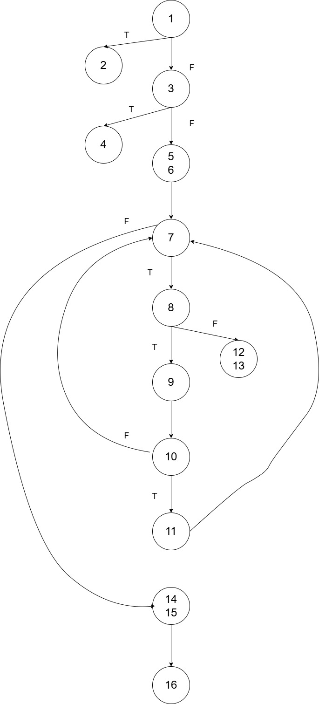
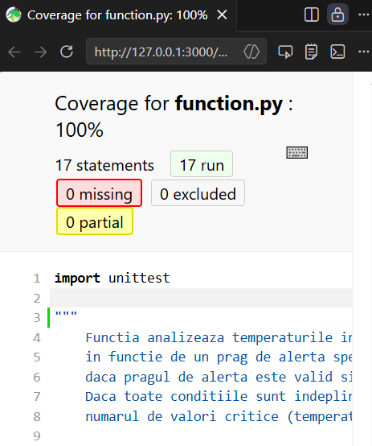
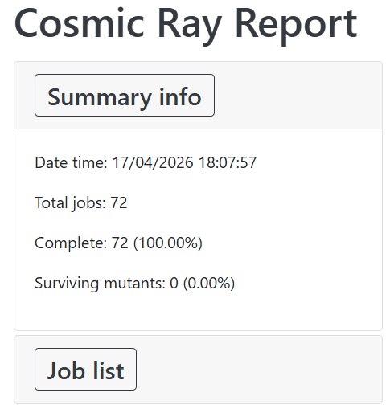

# Testare Unitara in Python

## Descriere

Aplicatia reprezinta un sistem de monitorizare a temperaturilor inregistrate de senzorii a 6 frigidere, determinand daca acestea sunt critice sau nu, in functie de un prag de alerta specificat. Sistemul verifica daca numarul de temperaturi este corect, daca pragul de alerta este valid si daca valorile temperaturilor sunt in intervalul permis: [-150, 0] grade.
Daca toate conditiile sunt indeplinite, se returneaza media temperaturilor si numarul de valori critice (temperaturi care depasesc pragul de alerta).

## Specificație

Serviciul ar trebui:
* Sa returneze mereu o valoare valida.
* Sa arunce o eroare in cazuri invalide.
* Numarul de temperaturi trebuie sa fie exact 6.
* Pragul de alerta trebuie sa fie mai mic sau egal cu -50.
* Valorile temperaturilor trebuie sa fie in intervalul [-150, 0].
* Temperaturile critice sunt cele care depasesc pragul de alerta.

## Configuratie Hardware

| Componenta | Descriere |
| :---: | :---: |
| CPU | Intel Core i5 (8th Gen) |
| RAM | 8 GB |
| Storage | 477 GB SSD (NVMe) |
| GPU | Intel (R) UHD Graphics 620 |
| OS | Windows 10 |

## Configuratie Software

| Componenta | Descriere |
| :---: | :---: |
| Limbaj | Python 3.13.11 |
| IDE | Visual Studio Code |
| Unit Testing | unittest |
| Version Control | Git |

## Demo

[](https://youtu.be/YbfVEBK7Q-g)

Link direct: https://youtu.be/YbfVEBK7Q-g

## Functional Testing

Functional testing este o metoda de testare software care se concentreaza pe validarea functionalitatilor unui sistem, asigurandu-se ca acestea corespund specificatiilor si cerintelor definite.

### 1. Partitionare in clase de echivalenta

Domeniul intrarilor:
* temperatures $\rightarrow$ lista de valori reale, exact 6 elemente, fiecare in intervalul [-150, 0]. Astfel, avem clase de echivalenta pentru lungime si valori.
* alert_threshold $\rightarrow$ valoare reala mai mica sau egala cu -50. Astfel, avem 2 clase de echivalenta:
    - $A_1$ = $(-\infty, -50]$.
    - $A_2$ = $(-50, +\infty)$.

Domeniul iesirilor:
Se returneaza un tuplu (media, numar_critic) daca datele sunt corecte, altfel se returneaza un mesaj de eroare sub forma unui string.

Clasele de echivalenta globale astfel obtinute sunt:
* $Eq_1 = \lbrace (t, a) | len(t) \neq 6 \rbrace$.
    - $T_1 = ([valori], a)$.
* $Eq_2 = \lbrace (t, a) | a > -50 \rbrace$.
    - $T_2 = (t, -40)$.
* $Eq_3 = \lbrace (t, a) | len(t) = 6, a \leq -50, \exists t_i \notin [-150, 0] \rbrace$.
    - $T_3 = ([-160, ...], -55)$.
* $Eq_4 = \lbrace (t, a) | len(t) = 6, a \leq -50, \forall t_i \in [-150, 0] \rbrace$.
    - $T_4 = ([-80, -60, -70, -80, -90, -100], -72)$.

| Intrari (t, a) | Expected |
| :---------: | :-----------: |
| $([valori], a)$ | "Exactly 6 temperature readings are required" |
| $(t, -40)$ | "Alert threshold must be less than or equal to -50" |
| $([-160, ...], -55)$ | "Sensor failure!" |
| $([-80, -60, -70, -80, -90, -100], -72)$ | (-80.0, 2) |

```python
def test_equivalence_partitioning(self):
    # L1, A1, T1 - test valid (O2)
    self.assertEqual(analyze_status([-80, -60, -70, -80, -90, -100], -72), (-80.0, 2))
    
    # L2
    self.assertEqual(analyze_status([-60]*5, -55), "Exactly 6 temperature readings are required")
    # L3
    self.assertEqual(analyze_status([-60]*7, -55), "Exactly 6 temperature readings are required")
    # L1, A2
    self.assertEqual(analyze_status([-60]*6, -40), "Alert threshold must be less than or equal to -50")
    # L1, A1, T2
    self.assertEqual(analyze_status([-160, -55, -70, -80, -90, -100], -55), "Sensor failure!")
    # L1, A1, T3
    self.assertEqual(analyze_status([-60, 10, -70, -80, -90, -100], -55), "Sensor failure!")

    # L1, A1, T1 - nicio temperatura critica (O1)
    self.assertEqual(analyze_status([-60]*6, -55), (-60.0, 0))
    # L1, A1, T1 - toate temperaturile sunt critice (O3)
    self.assertEqual(analyze_status([-60]*6, -70), (-60.0, 6))
```

### 2. Analiza valorilor de frontiera

Valorile de frontiera pentru clasa lungimii listei sunt:
- $L_1 \rightarrow 5, 7$.
- $L_2 \rightarrow 6$.

Valorile de frontiera pentru clasa pragului de alerta sunt:
- $A_1 \rightarrow -50 - \epsilon, -50$.
- $A_2 \rightarrow -50 + \epsilon$.

Valorile de frontiera pentru clasa temperaturilor sunt:
- $T_1 \rightarrow -150 - \epsilon, -150, -150 + \epsilon$.
- $T_2 \rightarrow -\epsilon, 0, +\epsilon$.

Astfel, avem urmatoarele teste:
* $Eq_1 \rightarrow (lungime \neq 6)$.
* $Eq_2 \rightarrow (prag > -50)$.
* $Eq_3 \rightarrow (temperaturi invalide)$.
* $Eq_4 \rightarrow (valori valide)$.

| Intrari (t, a) | Expected |
| :---------: | :-----------: |
| (5 temperaturi, -55) | "Exactly 6 temperature readings are required" |
| (6 temperaturi, -55) | (-60.0, 0) |
| (7 temperaturi, -55) | "Exactly 6 temperature readings are required" |
| (6 temperaturi, -50 - \epsilon) | (-60.0, 0) |
| (6 temperaturi, -50) | (-60.0, 0) |
| $(6 temperaturi, -50 + \epsilon)$ | "Alert threshold must be less than or equal to -50" |
| $(-150 - \epsilon, ...)$ | "Sensor failure!" |
| $(-150, ...)$ | (-91.67, 0) |
| $(-150 + \epsilon, ...)$ | (-91.67, 0) |
| $(-\epsilon, ...)$ | (-66.83, 1) |
| $(0, ...)$ | (-66.67, 1) |
| $(+\epsilon, ...)$ | "Sensor failure!" |

```python
def test_boundary_values(self):
    # frontiere lungimea listei

    #lungime la frontiera inferioara(5 elem)
    self.assertEqual(analyze_status([-60]*5, -55), "Exactly 6 temperature readings are required")
    #lungime la frontiera valida(6 elem)
    self.assertEqual(analyze_status([-60]*6, -55), (-60.0, 0))
    #lungime la frontiera superioara(7 elem)
    self.assertEqual(analyze_status([-60]*7, -55), "Exactly 6 temperature readings are required")

    # frontiere prag de alerta

    #prag la frontiera inferioara(-50.0001)
    self.assertEqual(analyze_status([-60]*6, -50.0001), (-60.0, 0))
    #prag la frontiera valida(-50.0)
    self.assertEqual(analyze_status([-60]*6, -50.0), (-60.0, 0))
    #prag la frontiera superioara(-49.9999)
    self.assertEqual(analyze_status([-60]*6, -49.9999), "Alert threshold must be less than or equal to -50")

    # frontiere valori temperaturi

    #inceputul intervalului - temp la frontiera inferioara(-150.0001)
    self.assertEqual(analyze_status([-150.0001, -60, -70, -80, -90, -100], -55), "Sensor failure!")
    #inceputul intervalului - temp la frontiera valida(-150.0)
    self.assertEqual(analyze_status([-150.0, -60, -70, -80, -90, -100], -55), (-91.67, 0))
    #inceputul intervalului - temp la frontiera superioara(-149.9999)
    self.assertEqual(analyze_status([-149.9999, -60, -70, -80, -90, -100], -55), (-91.67, 0))
    #sfarsitul intervalului - temp la frontiera inferioara(-0.0001)
    self.assertEqual(analyze_status([-0.0001, -60, -70, -80, -90, -100], -55), (-66.67, 1))
    #sfarsitul intervalului - temp la frontiera valida(0.0)
    self.assertEqual(analyze_status([0.0, -60, -70, -80, -90, -100], -55), (-66.67, 1))
    #sfarsitul intervalului - temp la frontiera superioara(0.0001)
    self.assertEqual(analyze_status([0.0001, -60, -70, -80, -90, -100], -55), "Sensor failure!")
```

## Structural Testing

Structural testing, cunoscuta si ca white-box testing, se concentreaza pe verificarea interna a codului sursa. Practic, se testeaza structura logica a programului si se asigura ca toate partile acestuia functioneaza conform asteptarilor.



```python
def analyze_status(temperatures, alert_threshold):
    if len(temperatures) != 6:                                      #1
        return "Exactly 6 temperature readings are required"        #2

    if alert_threshold > -50:                                       #3
        return "Alert threshold must be less than or equal to -50"  #4

    sum = 0                                                         #5
    critical_count = 0                                              #6

    for t in temperatures:                                          #7
        if t >= -150 and t <= 0:                                    #8
           sum += t                                                 #9  
           if t > alert_threshold:                                  #10
            critical_count += 1                                     #11
        else: 
            return "Sensor failure!"                                #12
        
    average = round(sum / len(temperatures), 2)                     #13
    return (average, critical_count)                                #14
```

### 3. Statement Testing

Verificam daca fiecare instructiune din cod a fost executata cel putin o data.

| Intrari (t, a) | Expected | Instructiuni acoperite |
| :---------: | :-----------: | :-----------: |
| $(5 temperaturi, -55)$ | "Exactly 6 temperature readings are required" | 1,2 |
| $(6 temperaturi, -40)$ | "Alert threshold must be less than or equal to -50" | 1,3,4 |
| $([-160, ...], -55)$ | "Sensor failure!" | 1,3,5,6,7,8,12 |
| $([-80, -60, -70, -80, -90, -100], -72)$ | (-80.0, 2) | 1,3,5,6,7,8,9,10,11,13,14 |

```python
def test_statement_coverage(self):

    # instruct 1, 2 <-- lungime lista invalida
    self.assertEqual(analyze_status([-60]*5, -55), "Exactly 6 temperature readings are required")
    
    # (1), 3, 4 <-- prag de alerta invalid
    self.assertEqual(analyze_status([-60]*6, -40), "Alert threshold must be less than or equal to -50")

    # (1, 3), 5, 6, 7, 8, 9, 10, 11, 14, 15, 16 <-- returneaza media si numarul de valori critice
    self.assertEqual(analyze_status([-60]*6, -70), (-60.0, 6))
    
    # (1, 3, 5, 6, 7, 8), 12, 13 <-- temperatura invalida
    self.assertEqual(analyze_status([-160, -55, -70, -80, -90, -100], -55), "Sensor failure!")
}
```

### 4. Decision Testing

Ne asiguram ca fiecare punct de decizie este evaluat atat pentru atat pentru conditia adevarata, cat si pentru cea falsa.

| Nr. | Decizie |
|-----|---------------------------------------------------------------------------------------|
| 1   | `if len(temperatures) != 6` |
| 2   | `if alert_threshold > -50` |
| 3   | `if t >= -150 and t <= 0` |
| 4   | `if t > alert_threshold` |

| Test | temperatures | alert_threshold | Rezultatul | Decizii acoperite |
|------|--------------|-----------------|------------|-------------------|
| T1   | 5 elem | -55 | eroare lungime | D1-true |
| T2   | 6 elem | -40 | eroare prag | D1-false, D2-true |
| T3   | 6 elem, temp invalida | -55 | eroare senzor | D1-false, D2-false, D3-false |
| T4   | 6 elem valide | -72 | (average, critical) | D1-false, D2-false, D3-true, D4-true/false |

```python
def test_decision_coverage(self):
    # decizia 1 adevarata:  1 --> 2
    self.assertEqual(analyze_status([-60]*5, -55) , "Exactly 6 temperature readings are required")

    # decizia 1 falsa, decizia 2 adevarata: ramura 1 --> 3 --> 4
    self.assertEqual(analyze_status([-60]*6, -40), "Alert threshold must be less than or equal to -50")
    
    # decizia 1 falsa, decizia 2 falsa, decizia 3 adevarata de 6 ori, apoi falsa, decizia 4 adevarata, 
    # decizia 5 adevarata prima oara, apoi falsa: ramura 1 -- 3 --> 5--> 6 --> 7 --> 8--> 9 --> 10 --> 11 --> 14 --> 15 --> 16
    self.assertEqual(analyze_status([-59, -61, -60, -60, -60, -60], -60), (-60.0, 1))

    # decizia 1 falsa, decizia 2 falsa, decizia 3 adevarata o data, decizia 4 falsa: ramura 1 -- 3 -- 5 -- 6 -- 7 -- 8 --> 12 --> 13
    self.assertEqual(analyze_status([-160, -100, -70, -80, -90, -100], -55), "Sensor failure!")
}
```

### 5. Condition Testing

Se concentreaza pe evaluarea fiecarei conditii individuale.

| Nr. | Decizie | Conditii individuale |
|----|------------------------------------------------------------------------------------|-----------------------------------------------------|
| 1 | `if len(temperatures) != 6` | `len(temperatures) != 6` |
| 2 | `if alert_threshold > -50` | `alert_threshold > -50` |
| 3 | `if t >= -150 and t <= 0` | `t >= -150`, `t <= 0` |
| 4 | `if t > alert_threshold` | `t > alert_threshold` |

| Test | temperatures | alert_threshold | Rezultatul | Conditii acoperite |
|------|--------------|-----------------|------------|-------------------|
| T1   | 5 elem | -55 | eroare lungime | C1-true |
| T2   | 6 elem | -40 | eroare prag | C1-false, C2-true |
| T3   | 6 elem, temp invalida | -55 | eroare senzor | C1-false, C2-false, C3.1-false |
| T4   | 6 elem valide | -72 | (average, critical) | C1-false, C2-false, C3.1-true, C3.2-true, C4 |

```python
def test_condition_coverage(self):
    # conditia 1 adevarata 
    self.assertEqual(analyze_status([-60]*5, -55) , "Exactly 6 temperature readings are required")

    # conditia 1 falsa, conditia 2 adevarata
    self.assertEqual(analyze_status([-60]*6, -40), "Alert threshold must be less than or equal to -50")

    # _ , _ , conditia 3 adevarata de 6 ori, apoi falsa, conditia 4 adevarata, coditia 5 adevarata, 
    # conditia 6 adevarata prima oara, apoi falsa 
    self.assertEqual(analyze_status([-59, -61, -60, -60, -60, -60], -60), (-60.0, 1))

    # _, _, conditia 3 adevarata o data, conditia 4 falsa 
    self.assertEqual(analyze_status([-160, -61, -60, -60, -60, -60], -60), "Sensor failure!")

    # _, _, conditia 3 adevarata o data, conditia 4 adevarata, conditia 5 falsa
    self.assertEqual(analyze_status([10, -61, -60, -60, -60, -60], -60), "Sensor failure!")
}
```

### 6. Circuit Coverage

Identificam setul de cai liniar independente (circuitelor) pentru functia `analyze_status` pe baza grafului de control-flow. Adaugand arcele necesare pentru a obtine un graf complet conectat, obtinem urmatoarele valori (conform analizei din `white_box_tests.py`):

- numarul de noduri: `n = 13`
- numarul de muchii: `e = 18`
- componente conexe: `p = 1`

Folosind formula pentru complexitatea ciclomatica a subrutinei (metodei) considerata in testele noastre: `V(G) = e - n + 1`, rezulta `V(G) = 18 - 13 + 1 = 6` circuite independente.

Aceste 6 circuite (descrise succint) sunt:
* Calea 1 (Eroare lungime): `1 --> 2 --> 1`
* Calea 2 (Eroare prag alerta): `1 --> 3 --> 4 --> 1`
* Calea 3 (iteratie in for, temperatura <= prag): `7 --> 8 --> 9 --> 10 --> 7`
* Calea 4 (iteratie in for, temperatura > prag): `7 --> 8 --> 9 --> 10 --> 11 --> 7`
* Calea 5 (returneaza valori valide): `1 --> 3 --> 5/6 --> 7 --> 14/15 --> 16 --> 1`
* Calea 6 (eroare senzor): `1 --> 3 --> 5/6 --> 7 --> 8 --> 12/13 --> 1`

Testele corespunzatoare (folosind aceleasi intrari si asteptari ca in `white_box_tests.py`) sunt:

| Intrari (t, a) | Expected | Circuitul |
| :---------: | :-----------: | :-----------: |
| `([-60]*5, -55)` | `"Exactly 6 temperature readings are required"` | Calea 1 |
| `([-60]*6, -40)` | `"Alert threshold must be less than or equal to -50"` | Calea 2 |
| `([-61, -60, -60, -60, -60, -60], -60)` | `(-60.17, 0)` | Calea 3 |
| `([-30]*6, -60)` | `(-30.0, 6)` | Calea 4 |
| `([-59, -61, -60, -60, -60, -60], -60)` | `(-60.0, 1)` | Calea 5 |
| `([-160, -61, -60, -60, -60, -60], -60)` | `"Sensor failure!"` | Calea 6 |

Exemplu de test (unittest) pentru acoperirea circuitelor independente:

```python
def test_independent_paths(self):
    # Calea 1 (Eroare Lungime)
    self.assertEqual(analyze_status([-60]*5, -55), "Exactly 6 temperature readings are required")

    # Calea 2 (Eroare Prag)
    self.assertEqual(analyze_status([-60]*6, -40), "Alert threshold must be less than or equal to -50")

    # Calea 3 (iteratie in for - temperatura <= prag alerta)
    self.assertEqual(analyze_status([-61, -60, -60, -60, -60, -60], -60), (-60.17, 0))

    # Calea 4 (iteratie in for - temperatura > prag alerta)
    self.assertEqual(analyze_status([-30]*6, -60), (-30.0, 6))

    # Calea 5 (returneaza valori valide)
    self.assertEqual(analyze_status([-59, -61, -60, -60, -60, -60], -60), (-60.0, 1))

    # Calea 6 (Eroare Senzor)
    self.assertEqual(analyze_status([-160, -61, -60, -60, -60, -60], -60), "Sensor failure!")
```


## Mutation Testing

Pentru testarea prin mutanti am folosit tool-ul `cosmic-ray`.

Rezultatul rundei de mutatie este in fisierul de raport `report.html` si indica **0 surviving mutants** (toti mutanti generati au fost detectati/"ucisi" de suitele de teste).

Concluzie: setul actual de teste ofera acoperire buna impotriva mutatiilor generate pentru modulele analizate.


## Test Results & Quality Metrics

### Coverage Report



Raportul de acoperire arata **100% coverage** pentru `function.py`, ceea ce inseamna ca toate instructiunile, branching-urile si conditiile din cod au fost executate in teste.

### Cosmic Ray Report



Raportul de testare prin mutanti (Cosmic Ray) confirma ca suita de teste este foarte eficace. Cu **0 surviving mutants** din 72 mutanti generati, rezultatul arata ca fiecare modificare (mutatie) introdusa in cod a fost detectata de cel putin un test. Aceasta validare garanteaza ca testele sunt suficient de robuste pentru a gasi erorile potentiale in implementare.


---

## Referinte bibliografice


[1] Python Software Foundation. (2024). "unittest - Unit testing framework". Python Documentation. https://docs.python.org/3/library/unittest.html

[2] Ned Batchelder. (2024). "Coverage.py - Code coverage measurement for Python". https://coverage.readthedocs.io/

[3] Cosmic Ray Contributors. (2024). "Cosmic Ray - Mutation testing for Python". https://cosmic-ray.readthedocs.io/


[4] Ammann, P., & Offutt, J. (2017). "Introduction to Software Testing" (2nd ed.). Cambridge University Press. ISBN: 978-1-108-10099-1

[5] Git Contributors. (2024). "Git - Version Control System". https://git-scm.com/

[6] Microsoft. (2024). "Visual Studio Code - Code Editor". https://code.visualstudio.com/

[7] Google AI. (2024). "Gemini - AI-powered code assistant". https://gemini.google.com/

[8] Universitatea din Bucuresti, Prof. Sorina Predut, Curs de Testarea sistemelor software - Notite de curs
